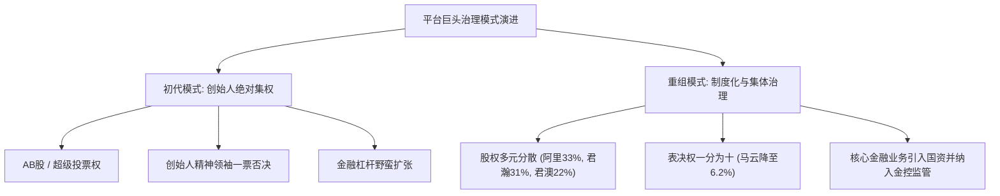
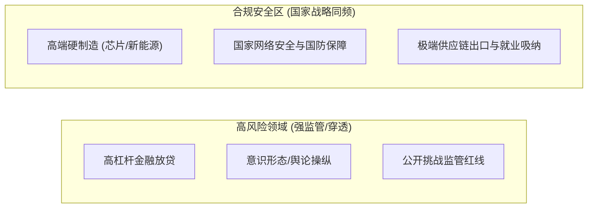

在当今中国商业与资本版图中，一个极具戏剧性却又发人深省的现象正在上演：曾被冠以“女巴菲特”之名的赵薇在演艺与资本版图双双停摆五年后，依靠早年海外离岸信托维持着优渥的退隐生活；初代互联网领袖马云在经历蚂蚁重组、交出实际控制权后，退居幕后专注农业与技术出海；而年仅四十岁上下的黄峥与张一鸣，则在公司问鼎巅峰之际决然卸任一切公开职务，肉身出海、隐身幕后，财富却伴随海外业务与 AI 浪潮屡创历史新高。

与此同时，雷军投身制造业造车押注全产业链国产替代，周鸿祎拆解红筹回归 A 股甘当政企网络安全盾牌，而老一代华人首富李嘉诚早在十多年前便以高位套现、换仓海外刚需基建完成了教科书级的跨周期大撤退。

梳理这一连串看似孤立的个体命运，背后折射出的是同一套严密、冷酷且运转清晰的政治经济学逻辑与政商生存法则。

---

### 一、 财富防波堤：境内信托与离岸信托的穿透博弈

坊间一度流传“赵薇从 66 亿身家跌落至身无分文”的耸动言论，然而司法与商业现实证明，这只是自媒体的夸大其词。虽然其国内多家关联公司千万元股权被司法冻结，但其早年布局的法国波尔多酒庄（如梦陇酒庄 Château Monlot）以及通过境外信托为子女在海外购置的不动产与金融资产，依然为其提供了坚固的财务安全网。

```text
+-----------------------------------------------------------------------------------+
|                            境内信托 vs 境外离岸信托对比                           |
+-------------------+-----------------------------------+---------------------------+
| 比较维度          | 中国大陆信托                      | 境外离岸信托 (英美法系)   |
+-------------------+-----------------------------------+---------------------------+
| 法律依据          | 《中华人民共和国信托法》          | 离岸法域信托法、衡平法    |
+-------------------+-----------------------------------+---------------------------+
| 监管穿透度        | 强穿透，受央行、外汇局与司法穿透  | 高隐私保护，司法独立管辖  |
+-------------------+-----------------------------------+---------------------------+
| 民事债务隔离      | 易受“欺诈债权”认定而被撤销        | 撤销门槛极高，设有时效壁垒|
+-------------------+-----------------------------------+---------------------------+
| 刑事/公权力穿透   | 刑事追缴与强监管下可被直接查封    | 不承认外国裁判，阻断跨境  |
+-------------------+-----------------------------------+---------------------------+
```

1. **大陆信托的法律边界**：
   - 大陆信托依据《信托法》确立了信托财产独立性，但在实操中存在致命的穿透漏洞。依据《信托法》第 12 条，若委托人设立信托旨在逃避债务或损害债权人利益，债权人可申请撤销。
   - 在强监管与刑事追缴介入时，大陆司法机关具有绝对优先权，信托外壳无法阻挡对涉案资产的查封与划扣。

2. **离岸信托的防波堤机制**：
   - 离岸法域（如开曼、BVI、库克群岛等）依托跨主权法律壁垒，对“欺诈性转移”设置了极短的起诉时效（通常仅 1 至 2 年）和极高的举证责任。
   - 境外法域普遍不直接承认并执行外国法院判决，海外追偿需在当地重新提起诉讼，时间与财务成本极高。
   - 巧妙的“危机触发条款”与独立保护人机制，可在境内委托人遭遇调查或诉讼瞬间将受益权或控制权自动剥离，实现法律层面的物理切断。

3. **当下的合规挤压与改良架构**：
   - 随着全球税务信息自动交换（CRS）的全面推行，以及外汇管制对非法资金出境（如地下钱庄、虚假贸易）的严厉打击，单纯依赖离岸壳公司隐匿资产的时代已经终结。
   - 顶级企业家的合规路径已演变为“税务居民身份置换 + 新加坡/香港家族办公室（如新加坡 VCC 架构）+ 多层离岸实体”的复合型合法配置，将资产安全前置于合规商业投资之中。

---

### 二、 权力的边界：巨头治理从“个人独裁”到“无实控人化”

马云与阿里巴巴、蚂蚁集团的治理重构，是中国平台经济反垄断与防范系统性金融风险的里程碑事件。



1. **蚂蚁集团的深度重组逻辑**：
   - **清理敏感资本**：在监管介入下，排查并剥离了带有特殊政治敏感背景的影子资本与交叉持股，阻断金融巨头向非市场化权力渗透的风险链条。
   - **终结一人独裁**：马云投票权从早期的 53.46% 稀释至 6.2%，表决权平均分散至管理层与员工代表等 10 名自然人手中，彻底消除单一实控人。
   - **核心业务国资引入与金控监管**：将花呗、借呗等消费贷业务重组为“蚂蚁消金”，引入国有资本（如杭州国资、中国信达等）进入董事会；全面纳入金融控股公司监管框架，执行与国有大行同等严格的资本充足率与杠杆限制。

2. **阿里巴巴的“去创始人化”与组织碎片化**：
   - 伴随“1+6+N”组织变革，集团控股公司转向资产与资本配置角色，各大业务板块设立独立董事会，打破昔日金字塔式的中央集权。
   - 阿里合伙人制度中马云的彻底退出，使公司治理逻辑向苹果、微软等国际主流现代公众公司靠拢——股权高度分散、职业经理人与董事会集体决策，以此卸下沉重的个人政治标签，降低监管审视烈度。

---

### 三、 少壮派的激流勇退：隐形生存与全球化身份解耦

对比马云在风波冲击下的“被动交权”，黄峥（拼多多）与张一鸣（字节跳动）则展现了截然不同的“主动隐退哲学”。

```text
+-----------------------------------------------------------------------------------+
|                           两代互联网领袖隐退逻辑对比                              |
+-------------------+-----------------------------------+---------------------------+
| 比较维度          | 初代创业者 (如马云)               | 少壮派技术极客 (黄峥/张一鸣)|
+-------------------+-----------------------------------+---------------------------+
| 隐退时机          | 遭遇强监管与政策风暴后的被动调整  | 公司业绩与用户规模登顶前夕主动退出|
+-------------------+-----------------------------------+---------------------------+
| 权力重构          | 实控权被彻底打破，合伙人制度重组  | 卸任公开职务，底层投票权与股权有效保留|
+-------------------+-----------------------------------+---------------------------+
| 业务重心          | 转向合规整改、公益与农业技术      | 押注海外市场 (Temu/TikTok) 与前沿 AI |
+-------------------+-----------------------------------+---------------------------+
| 公众形象          | 曾长年扮演行业导师与公众思想领袖  | 极度低调，彻底隐入幕后与技术研发  |
+-------------------+-----------------------------------+---------------------------+
```

1. **破除“首富诅咒”与出头鸟效应**：
   - 在中国商业历史语境中，财富榜往往伴随极高的监管聚焦度与社会舆论审视。黄峥在拼多多活跃买家数超越阿里当天卸任董事长，张一鸣在字节跳动营收狂飙时辞去 CEO，主动剥离耀眼的公众身份，是对“木秀于林，风必摧之”古老生存法则的自觉践行。

2. **跨国地缘政治下的“身份解耦”**：
   - 字节跳动与拼多多的核心增量和未来生命线高度依托全球市场（TikTok 与 Temu）。在复杂的地缘政治博弈中，带有浓厚中国本土色彩的强势创始人往往成为海外监管机构审查的焦点。
   - 创始人卸任职务、居于海外、将海外业务运营交由本土化管理团队与合规实体，是在制度层面推进“企业国际化、创始人隐形化”，为产品在全球范围的合法合规运营争取最大生存空间。

---

### 四、 幸存者画像：政商安全边界的四种形态

在中国商业环境中，企业家的安全并非取决于运气的偶然，而是取决于其商业模式与国家核心战略的契合度，以及其在政治与舆论场中的边界感。



#### 1. 低调太极与战略顺从：马化腾与李彦宏
- **马化腾的克制与边界**：腾讯的核心业务聚焦于社交与数字娱乐，虽然体量庞大，但在金融衍生和政策规制面前表现出极高的配合度。马化腾极少在公共政策领域公开发表锐利观点，在反垄断浪潮中主动收缩、全面配合合规改造，并在关键时刻退居幕后，将腾讯定位于国家数字化转型的底层连接器。
- **李彦宏的特许属性与硬科技押注**：中文搜索业务天然具备高度网络安全与舆论审查属性，百度长年严格服从内容监管规范；同时，百度早早将盈利投入到国家大力支持的 AI 大模型与无人驾驶赛道，展现出“体制外技术编外队”的纯粹工程师画像。

#### 2. 体制血统与供应链压舱石：柳传志与杨元庆
- **中科院的历史背书与改制功臣**：联想自诞生起大股东即为国科控股（中科院持股平台），具备深厚的体制血统。无论民间舆论如何激辩其早年改制细节，在国家历史评价与体制认知中，联想始终属于改革开放的标志性产物。
- **全球 PC 供应链与外贸窗口**：杨元庆作为顶级职业经理人，其核心价值在于维持联想跨国供应链的平稳运转。在合肥、武汉等制造基地，联想支撑着数十万就业人口与庞大的电子零配件出口，充当了中国制造业连接全球欧美市场的稳定润滑剂。
- **恪守“在商言商”的绝对顺从**：与因公开发表极端政治言论而遭遇法律严惩的反面案例形成鲜明对照，联想管理层面对舆论危机时选择严格保持沉默、主动提交合规审计报告，严格划清商人与政治权力的界限。

#### 3. 弃虚向实与国家安全盾牌：雷军与周鸿祎
- **雷军的实业转型与新能源链主**：在互联网金融风暴前夕，小米果断收缩消费信贷业务，将积累的资本与研发全部转向硬核实体制造。雷军亲率小米造车，构建起从汽车整车到自研芯片的庞大产业链，直接带动了国内汽车高端零配件的国产替代，创造了巨大的实体就业与工业税收，完美契合“科技自立自强”的国家主旋律。
- **周鸿祎的身份重构与安全兜底**：360 早年从美股私有化回归 A 股，完成了从民用杀毒软件向国家政企安全与国防基础设施的战略转型。周鸿祎主动交出核心安全技术支撑能力，成为部委、央企底层的安全御用盾牌。即便利率投资的哪吒汽车面临破产重整，周鸿祎早早通过 0 元转让增资权等法律手段进行了风险隔离，其在公众前以短视频网红、科普大叔的形象出现，有效消解了严肃的政治锋芒。

#### 4. 跨周期的终极撤离者：李嘉诚的政商智慧
- **高位套现，绝不赚最后一个铜板**：早在 2013 至 2015 年国内房地产与资本狂欢的顶点，李嘉诚便果断抛售内地与香港核心商业地产，套现数千亿港元，展现了对经济周期与政商风向的超前预判。
- **转仓海外刚需公用事业**：将套现资金重仓配置于英国及欧洲的电力、水务、燃气、港口与电信资产。这些公用事业不受单一经济周期与政策剧烈波动影响，能产生永续、稳定的公用事业现金流。
- **双重身份与不可撤销家族信托**：通过长子、次子的多重国籍身份，配合开曼群岛不可撤销家族信托（Li Ka-Shing Unity Trust），在法律与主权层面完成了资产与家族控制权的绝对隔离。
- **退进自如的分寸感**：在资产价格低谷期低调回港拿地、积极参与灾害慈善捐赠，既不挑战体制底线，又保持高度的资本自主权。

---

### 五、 核心启示：中国商业周期的底层铁律

纵观中国现代商业史的巨头演变，可以提炼出贯穿始终的三条底层铁律：

1. **权力与资本的主从秩序不可逆转**：在中国政治经济学框架内，国家公权力具有绝对主权，任何将商业资本膨胀为独立政治权力中心、试图挑战金融监管底线或操纵公共舆论的行为，都必然遭遇强力的结构性重塑。
2. **所有权与可见性的科学分离**：壮年隐退并非商业意志的挫败，而是高阶企业家在制度约束下探索出的进化形态。剥离名义头衔与公众聚光灯，交出形式管理权，借助合规信托与海外架构保全底层资产，已成为顶级财富守成的主流路径。
3. **商业价值的硬核实体化**：依靠流量垄断、金融放贷与无序加杠杆的草莽时代已彻底落幕。唯有深耕硬核科技、投身实体制造、保障供应链安全与筑牢国家安全底线的企业，才能在多变的政策周期与地缘博弈中获得真正的长久生存空间。
