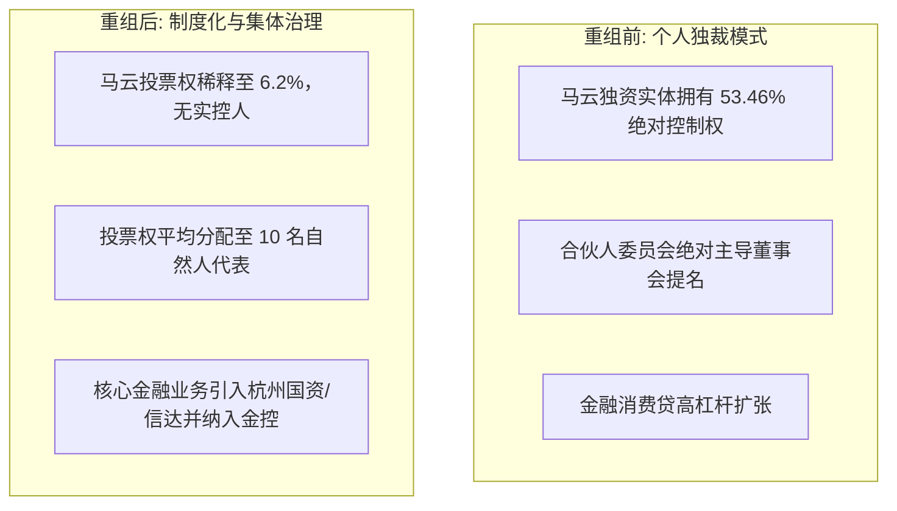

在西方商业世界中，比尔·盖茨、巴菲特或贝佐斯等商业领袖往往执掌帝国数十年，其个人声望与企业长期捆绑。而在中国，企业家的生命周期与公众角色呈现出截然不同的演化路径。

从昔日万众瞩目的“商业教父”与“青年导师”，到如今在三四十岁壮年主动隐退、去实控人化乃至彻底隐形，中国企业界上演了一场深刻的治理革命与生存进化。

---

### 一、 初代巨头的被动重塑：马云与阿里巴巴的去实控人化

马云与阿里、蚂蚁的历程，是中国第一代平台经济创始人面对国家监管意志时权力交接的典型范本。



1. **去实控人化的制度意义**：
   - 蚂蚁集团股权重组彻底清除了马云的单一独裁控制权，投票权分散至井贤栋等 10 位管理层与员工代表，实现投票权制衡；同时排查并剔除了带有政治敏感色彩的影子资本（如博裕资本等）。
   - 阿里巴巴推进“1+6+N”架构变革，各业务板块设立独立董事会。马云彻底退出合伙人组织，阿里转型为无实际控制人、由职业经理人与董事会共同治理的现代公众公司。

2. **退而不休的新角色**：
   - 经历重组落地后，马云并未受到物理层面的边控，而是频繁在东京、西班牙、东南亚等地考察农业技术与跨境电商，并在关键时刻回国督导阿里 AI 战略。这种低调而合规的行动轨迹表明，当个人政治标签被彻底剥离、企业完成合规化改造后，创始人与监管层达成了新的平衡。

---

### 二、 少壮派的主动隐退：黄峥与张一鸣的“隐形美学”

与初代企业家的“被动交权”不同，黄峥（拼多多）与张一鸣（字节跳动）则在公司业绩与用户规模达到历史顶峰的前夕，展现出了惊人的克制与主动退场智慧。

```text
+-----------------------------------------------------------------------------------+
|                           少壮派创始人的隐退与留存架构                            |
+-------------------+-----------------------------------+---------------------------+
| 创始人            | 隐退动作 (公开层面)               | 实际掌控与财富形态 (幕后) |
+-------------------+-----------------------------------+---------------------------+
| 黄峥 (拼多多)     | 辞去 CEO 与董事长，放弃超级投票权 | 保留大股东地位，海外 Temu 贡献全球财富;   |
|                   | 捐资 1 亿美元设立繁星科学基金     | 肉身脱离风暴核心，深耕生命科学            |
+-------------------+-----------------------------------+---------------------------+
| 张一鸣 (字节跳动) | 卸任 CEO 与董事长，退出董事会     | 保留 50% 以上底层投票权; 旅居海外遥控;    |
|                   | 宣称转向组织机制与前沿 AI 研究    | 豆包 AI 爆发与 TikTok 合规推动身家登顶    |
+-------------------+-----------------------------------+---------------------------+
```

1. **金蝉脱壳的政治智慧**：
   - 黄峥在拼多多买家数登顶中国第一当天辞职，张一鸣在字节跳动营收逼近千亿美元时退居幕后。他们敏锐地避开了财富榜“首富诅咒”与公众舆论的聚光灯，将“创始人个人名誉”从企业主干中剥离。
2. **所有权与可见性的分离**：
   - 他们放弃了日常管理权与台前的社会头衔，但在幕后通过海外信托、股权代持以及核心投票权设计，依然是企业的终极受益人。伴随 Temu 席卷全球和字节跳动在 AI（豆包）与全球短视频的持续突破，他们的个人财富反而创下历史新高。

---

### 三、 幸存者图谱：中国商业领袖的四种生存形态

中国商业界不同派系企业家的命运分野，呈现出清晰的分类特征与生存逻辑。

```text
+-----------------------------------------------------------------------------------+
|                           中国商业领袖生存形态谱系                                |
+-------------------+-----------------------+-------------------+-------------------+
| 类型              | 代表人物              | 核心商业模式      | 政治安全底牌      |
+-------------------+-----------------------+-------------------+-------------------+
| 太极隐形派        | 马化腾、李彦宏        | 社交娱乐 / 搜索AI | 极端低调、顺从合规|
+-------------------+-----------------------+-------------------+-------------------+
| 体制长子派        | 柳传志、杨元庆        | 跨国 PC 供应链    | 中科院国资大股东  |
+-------------------+-----------------------+-------------------+-------------------+
| 弃虚向实派        | 雷军、周鸿祎          | 智能汽车 / 网络安全| 实体制造、国家盾牌|
+-------------------+-----------------------+-------------------+-------------------+
| 政治越界者 (反面) | 任志强 (历史案例)     | 房地产资本        | 挑战体制政治底线  |
+-------------------+-----------------------+-------------------+-------------------+
```

#### 1. 低调太极与战略顺从：马化腾与李彦宏
- **马化腾**：始终践行“在商言商、闷声发财”。腾讯核心业务为社交与游戏娱乐，不触碰国家金融杠杆命脉。在历次监管风波中，马化腾主动隐退会场、极少接受公开采访，将腾讯定位为国家数字化转型的底层基础设施。
- **李彦宏**：搜索业务天然承担网络意识形态安全审核职能，长期与监管保持高强度协同；同时，百度将利润全力押注于国家重点扶持的自动驾驶（Apollo）与人工智能大模型，展现出“体制外技术编外队”的纯粹工程师形象。

#### 2. 体制血统与供应链看门人：柳传志与杨元庆
- **国资大股东的政治护身符**：联想第一大股东长年为中国科学院直属的国科控股，柳传志本质上属于体制内改制功臣。在历次舆论争议中，联想始终受到体制层面的历史定性保护。
- **杨元庆的职业经理人定位**：杨元庆并非企业的实际所有者，而是体制委派与认可的高级职业经理人。其核心价值在于维持合肥、武汉等庞大制造基地的就业与出口，为中国电子工业在欧美市场保留合规商业窗口。面对民间舆论时严格保持沉默，向监管机关及时汇报，展现出绝对的顺从性。

#### 3. 弃虚向实与国家安全绑定：雷军与周鸿祎
- **雷军的实业报国与新能源链主**：小米在风暴前夕迅速剥离消费金融业务，将数百亿资金砸向实体制造。雷军亲率小米造车三年交付数十万辆，带动国内汽车零部件全产业链国产替代，成为高端制造业与实体就业的标杆功臣。
- **周鸿祎的安全盾牌与网红自嘲**：360 从美股退市回 A 股，彻底放弃民用流量争夺，转型为部委、军队与央企的底层网络安全国家队；周鸿祎在公众前以短视频网红形象活跃，消解自身政治严肃性；而在哪吒汽车破产重整中，早早通过 0 元转让增资权完成风险隔离，确保主业不受牵连。

#### 4. 政治红线警示：任志强案例的启示
- 与柳传志“在商言商”、马云“交权合规”截然相反，历史上的反面案例表明，在政治体制内，商业贪婪或管理争议尚有整顿与罚款的缓冲空间，但若依仗红二代背景或资本实力公开发表挑战政治权威的极端言论，则必将触发最高级别的政治惩戒。

---

### 四、 结语：中国企业家的进化终局

中国商业环境的沧桑巨变，终结了草莽英雄指点江山的时代。当今能够穿越周期的企业家，无一不是深刻领悟了政商边界、主动割舍个人聚光灯、将企业命运与国家硬核战略深度同频的“制度适应者”。从造神到隐形，是商业逻辑向政治经济学规律的终极回归。
