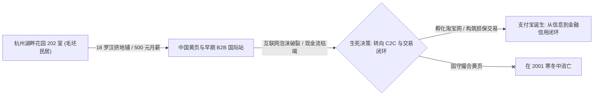
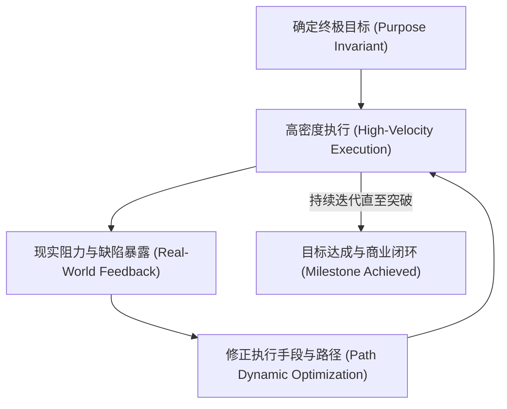

科技界历来沉迷于浪漫化的“车库神话”。

从硅谷帕罗奥多的惠普车库，到洛斯阿尔托斯乔布斯父母的平房车库，再到西雅图郊区贝索斯打包图书的住宅车库，这些故事经过数十年的媒体渲染与公关包装，早已被镀上了一层近乎宗教式的创业光环。

然而，剥离掉好莱坞式的滤镜，真实的早期创业现场既不体面，也不浪漫。无论是在二十世纪末的硅谷车库，还是世纪之交中国南方那些充斥着汗臭与外卖盒的逼仄民房，所有能从死人堆里爬出来的巨头，其早期形态都指向极其残酷的生存命题：**极低的试错成本、对真实商业交易的极致渴求，以及一种近乎偏执的执行主义。**

---

### 一、 车库文化的真伪辨析：四种原始演进范式

在硅谷早期历史上，真正诞生于物理车库或学生公寓的项目，往往具备鲜明的共性：没有大公司雄厚资源的庇护，创始人必须在极窄的生存夹缝中把最小可行性产品（MVP）硬造出来。

```text
+-------------------------------------------------------------------------+
|                        车库项目的四大底层演化范式                        |
+-------------------+-----------------------------------------------------+
| 1. 技术突破型     | HP (音频振荡器) / Apple (Apple I) / Google (BackRub)|
|                   | 先突破此前无法实现的技术瓶颈，再寻找商业变现场景    |
+-------------------+-----------------------------------------------------+
| 2. 需求重构型     | Amazon (在线书店) / Dell (直销PC) / Airbnb (气垫床) |
|                   | 不发明底层物理技术，依靠已有基础设施重构高效率交易  |
+-------------------+-----------------------------------------------------+
| 3. 开发者基建型   | Microsoft (BASIC解释器) / Cisco (路由器) / Stripe   |
|                   | 面向技术人员售卖生产力工具，由客户替平台创造下一层价值|
+-------------------+-----------------------------------------------------+
| 4. 极端履约型     | 放弃中间商链条，以近乎零的管理摩擦形成结构性成本优势|
+-------------------+-----------------------------------------------------+
```

真正值得深思的是**开发者基础设施型（Developer Infrastructure）**。以现代的 Stripe 为例，早期的科里森兄弟没有庞大的销售团队去公关大企业，而是写出极其简练的七行代码，让全世界的独立开发者在几分钟内接入在线信用卡收款。

这种模式的威力在于：**基础设施提供者不直接参与终端消费者的争夺，而是成为所有下层商业行为的税票印制机。** 这一商业范式，也是理解当今 AI 智能体时代（如 Agent 运行时、状态机调度底座）最关键的历史罗盘。

---

### 二、 中国民房创业的真实底色：湖畔花园与蔡崇信的抉择

与美国中产阶层社区宽敞的独栋车库不同，中国第一代互联网创业者的起点更为草莽。中国本土的“车库”，大多是大学筒子楼、中关村柜台，或者城乡结合部潮湿闷热的民房。

1999 年的杭州湖畔花园风荷苑 16 幢 1 单元 202 室，便是一个极其真实的中国样本。



1. **去滤镜化的现场**：
   - 湖畔花园不是现代科技园区的高档 Loft，而是一间普通的民宅。十八个人吃住全在一起，房间里常年弥漫着二手烟、汗臭与脚臭，地板上铺满床褥，服务器主机在一旁昼夜轰鸣；
   - 所谓“让天下没有难做的生意”，在最初并非宏大的演讲稿，而是为了每天能卖出几单企业黄页会员、按时发出 500 元月薪的生存挣扎。

2. **蔡崇信的历史性下注**：
   - 当时任职于瑞典 Investor AB 的蔡崇信，年薪高达 70 万美元，是华尔街标准的精英投资人。他来到湖畔花园考察时，看到的不是光鲜的商业计划书，而是马云带着十几个年轻人像信徒一样疯狂讨论代码与客户；
   - 蔡崇信毅然辞去高薪职位加入阿里、每月只领 500 元工资，核心原因在于他看到了**极低边际成本下的组织凝聚力与执行密度**。他为草莽阿 brutal 带去了现代公司架构、期权池设计与高盛的 500 万美元早期融资，完成了中国互联网史上最关键的制度补全。

3. **方向的生死蜕变**：
   - 如果阿里巴巴当年死守最初的 B2B 贸易信息黄页，在 2000 年互联网泡沫破裂后很可能已经销声匿迹；
   - 真正让阿里穿透周期的，是其在绝境中迅速调转船头切入淘宝（C2C 交易），并不惜一切代价孵化支付宝。**从“提供信息”走向“承接真实交易与担保履约”，是所有草根项目活过周期的生死分水岭。**

---

### 三、 早期腾讯的生死关头与资本错位

同期的深圳华强北，腾讯的开局同样如履薄冰。

1999 年至 2000 年间，马化腾与创始团队开发出的 OICQ（后改名为 QQ）用户量呈爆炸式指数增长，但当时中国的电信体系与广告变现机制完全无法支撑这种规模。用户越多，服务器托管费与带宽开支越大，腾讯几乎每天都在破产边缘徘徊。

```text
+-------------------+-----------------------------------+---------------------------+
| 资本参与方        | 早期决策与操作                    | 周期最终结局              |
+-------------------+-----------------------------------+---------------------------+
| IDG 资本          | 2000 年注资 220 万美元占股 20%    | 2001 年因看不到盈利提前套现离场 |
+-------------------+-----------------------------------+---------------------------+
| 盈科数码 (李泽楷) | 2000 年注资 220 万美元占股 20%    | 2001 年以 1260 万美元抛售全部股份 |
+-------------------+-----------------------------------+---------------------------+
| 南非报业 (MIH)    | 2001 年全面接盘 IDG 与盈科出让份额| 长期持有，成为人类投资史最大回报之一 |
+-------------------+-----------------------------------+---------------------------+
```

当时马化腾曾四处寻找买家，甚至一度开价 50 万元人民币试图将 OICQ 卖给搜狐张朝阳，却因张朝阳团队“看不懂一个寻呼机软件有什么价值”且嫌贵而告吹。

更具讽刺意味的是早期投资机构的从众与退缩：
- IDG 与李泽楷旗下的盈科数码动力虽然在早期各自投了 220 万美元，但在 2001 年互联网寒冬来临时，面对腾讯迟迟无法清晰自证的盈利模式，双双选择割肉套现；
- 最终，来自传统传媒背景的南非报业（MIH）以极其冷静的实业视角，看到了 QQ 占据中国网吧年轻人即时沟通入口的垄断性心智，接盘了 IDG 与李泽楷抛弃的股份，造就了商业投资史上的神话。

这一段历史给技术创业者留下了深刻的警示：**资本市场往往是周期性恐慌的，顶尖投资机构同样会因为短期财报与大盘风向在黎明破晓前斩仓。唯有构建坚实的自我造血与网络效应，才能避免在资本退潮时被动窒息。**

---

### 四、 牌桌法则：没有下注的人没有决策权

很多创业者在面对外部资方（尤其是所谓的顶级风投、孵化器或行业评委）时，极容易患上“导师依赖症”。当资方提出“你的方向太大、建议你收窄到某个极小单点流程”时，团队往往陷入自我怀疑与频繁转向。

但现代商业博弈的牌桌法则极其冷酷：

> **建议不等于决策权。没有拿真金白银下注的人，可以为你提供信息维度，但绝不能替你决定战略目标。**

1. **外部建议的局限性**：
   - 投资机构的合伙人与分析师大多背负着内部风控汇报与基金退出期限（Fund Horizon）的 KPI。他们给出的建议，本质上是在用“已被市场验证的模板”去套裁你的原生构想，试图把风险降到最低；
   - 当他们建议你把一个全功能平台收窄为“单个流程的代工插件”时，他们是在为自己的风控写说明，而不是为你的终局负责。

2. **真正的下注标准**：
   - 如果一个外部观察者真切认为你的战略路径可行或不可行，最具说服力的表达方式不是高谈阔论，而是开出支票、承担亏损、坐到牌桌上成为同盟；
   - 对于不承担任何后果的旁观噪音，创业者应保持极度的清醒：战略由自己制定，代价格局由自己承担。

---

### 五、 终极提炼：执行主义（Executionism）

回顾从硅谷车库到中国民房的三十年演化，所有能够在不可预知的动荡中存活下来的系统，其底层运转的都不是华丽的战略蓝图，而是一套高度自洽的**执行主义哲学（Executionism）**。



这套执行哲学的核心只有两句话：

> **既定目标不能改变。**
> 
> **执行 → 发现问题 → 修正方法 → 继续执行。**

#### 1. 目标恒定，路径动态（Purpose Invariant, Path Dynamic）
- 盲目死磕单一方法叫固执；
- 面对挫折不断更换目标叫摇摆；
- 执行主义是第三种状态：**牢牢钉死北极星目标，但对实现目标的战术路径、代码架构与交付手段保持完全开放与敏捷。** 现实的碰撞只能修正你的工具和路线，绝不能稀释你的终局目的。

#### 2. 人机一致的执行契约
这一哲学不仅适用于人类团队，同样是多智能体（Multi-Agent）与自动化工程的底层准则：
- 接收到任务后不空谈理论，迅速落地执行；
- 遇到环境变动或执行失败，触发反射自愈与技能蒸馏；
- 修正动作后立即推进下一轮执行，直到任务彻底交付闭环。

---

### 六、 结语

车库与民房的本质，从来不是贫穷的代名词，而是一种**对真实成本的极致清醒，以及对冗余形式主义的彻底唾弃**。

当今天的科技界再次陷入大模型泡沫与虚假繁荣的焦虑时，我们最需要找回的，恰恰是当年湖畔花园与早年车库里的那一股粗粝之气：

**不在幻觉中迷失，不在噪音中动摇；锁定目标，动手执行，修正方法，穿越周期。**
