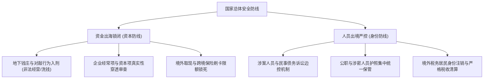

在当今中国宏观经济与地缘政治的叙事中，资本与权力的互动逻辑正在经历深刻的范式转移。过去的“市场至上”与资本无序加杠杆扩张模式已彻底终结，取而代之的是公权力对金融安全、数据主权与实体工业的绝对掌控。

从资金出境的严密外汇围堵，到人员流动的精准管控，再到中国科技跨国巨头在海外地缘对抗中的夹板气，一幅宏大的国家意志与资本重构图景正清晰展开。

---

### 一、 权力与资本的主从秩序：不能有第二个“太阳”

理解中国商业环境的首要前提，是厘清政治权力与市场资本的底层从属关系。

```text
+-----------------------------------------------------------------------------------+
|                           中西方资本与权力关系模型对照                            |
+-------------------+-----------------------------------+---------------------------+
| 比较维度          | 西方资本主义模型                  | 中国特色社会主义政治经济学|
+-------------------+-----------------------------------+---------------------------+
| 权力核心          | 资本深度参与并影响政治决策        | 政治权力拥有绝对的最高主权|
+-------------------+-----------------------------------+---------------------------+
| 互动模式          | 游说制度、政治献金、政商旋转门    | 资本必须服从国家总体战略与规制|
+-------------------+-----------------------------------+---------------------------+
| 巨头边界          | 允许跨国托拉斯跨界扩张            | 严防资本形成平行的权力中心|
+-------------------+-----------------------------------+---------------------------+
```

1. **绝对主权的排他性**：
   - 当互联网平台的算法比行政机关更了解社会舆论走向，当巨头的消费信贷与支付网络渗透到数以亿计公民的日常生活，在顶层治理视角中，这已不再是单纯的民营企业，而是可能危及金融安全与社会稳定的“平行权力中心”。
   - 2020 年以来的平台经济反垄断与金融整顿，本质上是一场主权确立战：任何试图利用资本挑战监管红线、甚至指点国家宏观政策的行为，都会遭遇毁灭性的结构性纠偏。

2. **政策不确定性与“运动式”监管**：
   - 相比西方依靠冗长国会辩论和司法诉讼推进的法制环境，国内宏观调控往往呈现出行政主导与快速纠偏的特征。
   - 从教培行业的周末重构，到房地产三道红线的落地，再到金融科技估值泡沫的刺破，政策的强力调控可在极短时间内重塑整个产业链格局。对于市场主体而言，缺乏长期政策预期使得“防守自保”成为最理性的战略选择。

---

### 二、 资本与人员流动的“闭环锁闭”机制

近年来，人员流动与资本流动的同步收紧，构成了宏观金融安全防线的两大支柱。



1. **资本出境的严密防线**：
   - **地下对敲全面入刑**：公安部门与国家外汇管理局利用大数据及反洗钱监测模型，全面打击跨境资金对敲与地下钱庄，以往通过虚假贸易合同或服务费转移资金的通道被系统性拆除。
   - **真实性穿透核查**：银行对企业对外直接投资（ODI）实施极为严苛的穿透式实质审查，彻底堵死以虚假海外并购、空壳对外投资为掩护的资本外逃路径。
   - **个人跨境额度压实**：每人每年 5 万美元结售汇额度受到严格的用途监管，境外 ATM 取现限额、限制境内卡购买境外储蓄型保险等措施，使得散户与高净值人群的资金离岸通道大幅收窄。

2. **隐形边界与人员出境管控**：
   - **司法边控的前置化**：在涉及民商事纠纷、股东税务稽查或未结诉讼案件中，法院可依法迅速采取限制出境措施。
   - **特定行业因私护照统管**：体制内人员、国企管理层、核心科研与金融技术人员的护照管理规范化，因私出国需履行严格审批。
   - **国籍注销与税务清算壁垒**：对于拟注销中国国籍并移居海外的人员，税务部门推行严格的个税清算与离境审计，确保境内税收权益不流失。

---

### 三、 地缘博弈下的全球夹板气：中资出海的双重审视

伴随国内市场内卷加剧，中国顶级科技与制造业巨头纷纷将未来增量押注于全球化出海（如短视频、跨境电商、新能源汽车）。然而，在地缘政治高度对抗的大环境下，出海企业面临着空前严峻的“双重审视”。

```text
+-----------------------------------------------------------------------------------+
|                             中资出海企业的地缘夹板气                              |
+-------------------+-----------------------------------+---------------------------+
| 审查方            | 关注核心与审查手段                | 企业面临的合规成本        |
+-------------------+-----------------------------------+---------------------------+
| 西方国家 (美/欧)  | 国家安全、数据回流、算法操控、剥离| 面临强制出售、禁用与听证会|
+-------------------+-----------------------------------+---------------------------+
| 中国本土监管      | 核心算法外流、敏感数据安全、海外合规| 实施网络安全审查与境外上市备案|
+-------------------+-----------------------------------+---------------------------+
```

1. **西方国家的合规围剿**：
   - 在欧美市场，中资背景的跨国平台（如 TikTok、Temu）天然被置于国家安全透镜下审视。西方政府以“防止用户数据泄露与算法操纵”为由，频繁施加听证会、数据本地化（如得克萨斯计划）乃至剥离法案等政治压力。
   - 企业为了在海外生存，不得不被迫推进管理团队本地化、引入西方财团（如甲骨文、银湖资本）作为合规伙伴，并在股权结构上做出重大妥协。

2. **本土数据主权的安全红线**：
   - 与此同时，国内对核心算法输出、跨境数据流动以及境外上市架构实施严密的《网络安全法》与《数据安全法》审查。中资企业若在海外过度迎合西方审查，极易触碰本土关于数据主权与关键技术保护的红线。

3. **从“野蛮扩张”到“合规求生”**：
   - 在此宏观周期下，过去依靠粗放资本补贴、快速抢占海外市场的模式已难以为继。中国企业的全球化必须在极其狭窄的政经夹缝中，以高维度的合规能力、精密的治理架构与本地化利益绑定，寻找极其脆弱的动态平衡。
