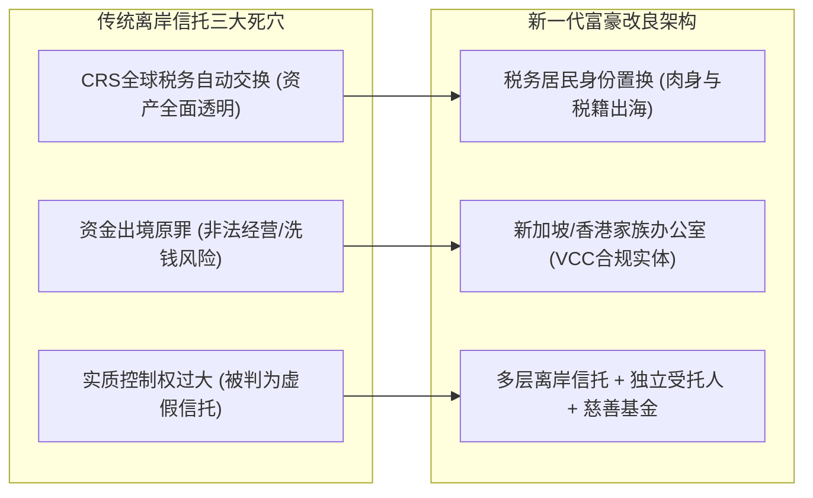

在公众舆论场中，常常流传着某位昔日明星或富豪“一夜之间身无分文”的离奇故事。然而，在真实的现代金融与法律体系中，顶级财富的保全早已超越了简单的银行存款与个人名下房产，演变成一套跨主权、多层级、法律隔离严密的金融工程学。

从赵薇在国内数千万元股权遭遇司法冻结却依然坐拥海外顶级酒庄与信托资产，到黄峥、张一鸣等新一代科技新贵在全球范围内的家族架构布局，再到李嘉诚数十年前便搭建完成的家族信托帝国，微观财富管理的防御逻辑展现出极高的专业门槛与制度博弈。

---

### 一、 谣言与真相：赵薇的资产版图与信托防御

自媒体常将国内法院的司法执行信息夸大为“破产”、“身无分文”。以赵薇为例，真实的资产图景呈现出高度分化的“境内冻结、海外隔离”状态：

```text
+-----------------------------------------------------------------------------------+
|                              赵薇资产境内外分布现状                               |
+-------------------+-----------------------------------+---------------------------+
| 资产板块          | 法律状态                          | 实际影响与现金流          |
+-------------------+-----------------------------------+---------------------------+
| 国内企业股权      | 名下龙薇传媒等多家公司千万元股权  | 国内演艺与资本变现彻底锁死|
|                   | 被司法冻结至 2029 年，承担连带赔偿|                           |
+-------------------+-----------------------------------+---------------------------+
| 海外不动产与酒庄  | 法国波尔多 4 座顶级酒庄 (如梦陇)   | 由境外独立架构持有，提供稳|
|                   | 新加坡高端住宅 (为子女设立信托)   | 定的跨境现金流与生活保障  |
+-------------------+-----------------------------------+---------------------------+
| 婚姻与债务隔离    | 依法与黄有龙正式离婚并完成分割    | 阻断前夫境外赌债等连带责任|
+-------------------+-----------------------------------+---------------------------+
```

1. **境内资产锁死**：因当年万家文化虚假陈述案余波及关联担保，其在国内的股权被依法冻结，演艺代言和商业通道全线关闭。
2. **海外核心资产存续**：赵薇夫妇在 2017 年之前（监管风暴与资本出境管控收紧前），便通过合法的海外商业投资将核心财富置换为波尔多酒庄（Château Monlot 等）与海外信托资产。这些资产独立于个人民事债务，构成了其退隐生活的坚实底牌。

---

### 二、 法律防波堤：中国大陆信托 vs 境外离岸信托

为什么国内法院的裁判难以波及离岸资产？大陆信托与离岸信托在实操中存在本质区别。

```text
+-----------------------------------------------------------------------------------+
|                        大陆信托与境外离岸信托关键指标深度对比                     |
+-------------------+-----------------------------------+---------------------------+
| 维度              | 中国大陆信托                      | 英美法系离岸信托 (开曼/BVI)|
+-------------------+-----------------------------------+---------------------------+
| 法律依据          | 《中华人民共和国信托法》          | 当地信托法、衡平法        |
+-------------------+-----------------------------------+---------------------------+
| 财产登记制度      | 缺乏完善的非现金信托登记制度      | 支持股权、不动产、知识产权|
+-------------------+-----------------------------------+---------------------------+
| 欺诈性转移认定    | 《信托法》第12条: 损害债权即撤销  | 设 1-2 年极短时效，排他证明|
+-------------------+-----------------------------------+---------------------------+
| 司法裁判执行      | 境内法院直接执行与强制划扣        | 普遍不承认外国判决，需重诉|
+-------------------+-----------------------------------+---------------------------+
| 刑事与行政穿透    | 强监管与刑事追缴直接穿透          | 依托主权独立，阻断外部穿透|
+-------------------+-----------------------------------+---------------------------+
```

1. **大陆信托的易穿透点**：
   - 依据《信托法》第 12 条，若委托人设立信托时已存在债务危机，债权人极易以“恶意逃债、损害债权”为由诉请法院撤销信托。
   - 在涉及重大经济犯罪或公权力刑事追缴时，公权力机关可依法直接穿透并冻结信托资产。

2. **离岸信托的三大防火墙**：
   - **极高的撤销门槛**：离岸法域（如开曼群岛、库克群岛）规定债权人必须在信托设立后 1 至 2 年内提起诉讼，且必须达到刑事级别的严苛举证，证明委托人设立时已处于彻底破产状态。
   - **不予承认外国判决**：境内法院判决在离岸岛国不自动具备执行力，债权人必须跨境聘请当地律师重新打官司，诉讼成本极高且面临极严的隐私保密壁垒。
   - **危机自动剥离机制**：信托契约中通常设有“自动保护人”条款，一旦委托人遭遇母国司法调查或资产冻结，信托控制权或受益权会瞬间转移至境外独立第三方，阻断追索。

---

### 三、 离岸信托的“三大死穴”与架构升级

离岸信托并非法外之地。随着全球反洗钱与监管透明化，传统离岸架构面临三大严峻挑战：



1. **CRS 全球税务信息自动交换**：离岸岛国金融机构定期向中国税务部门交换账户余额与收益信息，单纯隐匿资产在技术上已不可行。
2. **资金来源与外汇原罪**：若资金当年系通过地下钱庄或虚假贸易出境，一旦涉嫌刑事犯罪，中国可通过跨国司法协作促使外资银行冻结账户。
3. **“虚假信托”判定（Illusionary Trust）**：若委托人在信托中保留了过大的投资决策权与随意撤销权，英美法系法院可判定其缺乏独立性而宣布信托无效。

---

### 四、 顶级富豪的财富架构范本

为了应对合规风暴，新老两代顶级富豪探索出了不同的高阶财富管理范本。

```text
+-----------------------------------------------------------------------------------+
|                             顶级富豪财富架构模式对照                              |
+-------------------+-----------------------+---------------------------------------+
| 代表人物          | 财富管理工具          | 架构设计与防护特点                    |
+-------------------+-----------------------+---------------------------------------+
| 黄峥 (拼多多)     | 繁星科学基金 +        | 将部分股权捐赠成立计算医学与农业科研  |
|                   | 海外多层股权信托      | 基金; 依托 Temu 海外主体实现资产合规增值|
+-------------------+-----------------------+---------------------------------------+
| 张一鸣 (字节跳动) | 全球家族办公室 +      | 设立新加坡/香港家办; 采用多层信托架构;|
|                   | 投票权信托隔离        | 剥离公开管理权，保留底层分红与超级投票|
+-------------------+-----------------------+---------------------------------------+
| 李嘉诚 (长和系)   | 开曼不可撤销家族信托  | 将上市公司核心股权装入信托(Li Ka-Shing|
|                   | (Unity Trust) +       | Unity Trust); 家族成员持加拿大双重国籍;|
|                   | 英国公用事业刚需资产  | 重仓抗周期的水电燃气电信，享受永续分红|
+-------------------+-----------------------+---------------------------------------+
```

#### 1. 黄峥：科研基金与全球多层架构
- 卸任拼多多公开职务后，黄峥向母校浙江大学捐赠 1 亿美元设立“繁星科学基金”，专注计算医学、细胞生物学等硬核前沿研究，借助慈善基金实现资产的社会化与合规保全；同时通过境外合规架构持有拼多多与 Temu 的底层股权。

#### 2. 张一鸣：新加坡家族办公室与投票权隔离
- 字节跳动创始人张一鸣旅居新加坡，利用主流金融中心的家族办公室（如新加坡 VCC 架构）替代开曼、BVI 等传统避税地。通过精密的信托契约设计，在确保对字节跳动（含 TikTok、豆包 AI）底层投票权与收益权的同时，完成了企业国际化与个人税籍的合规对冲。

#### 3. 李嘉诚：跨周期的终极财富范式
- **高位变现与转仓刚需**：在 2013 至 2015 年中国房产牛市顶点套现数千亿港元，转仓至英国的电力、供水、天然气等底层公共基础设施，换取抗通胀、抗周期的永续现金流。
- **开曼不可撤销家族信托（Unity Trust）**：将千亿核心上市公司股权全部装入信托，受益人为家族后代，从法律层面与个人债务彻底阻断。
- **双重国籍与多币种配置**：李氏家族核心成员长年持有加拿大等双重国籍，配合全球跨币种资产配置，实现了从资产、实体到肉身的全方位跨周期防御。

---

### 五、 结语

在现代资本博弈中，财富的真正护城河不是账面数字的膨胀，而是在危机来临前的合规前瞻性、法律架构的严密性以及跨周期的资产配置能力。从赵薇的酒庄信托到李嘉诚的家族信托，微观财富管理的本质，是一场关于法律规则、制度博弈与人性克制的终极考验。
