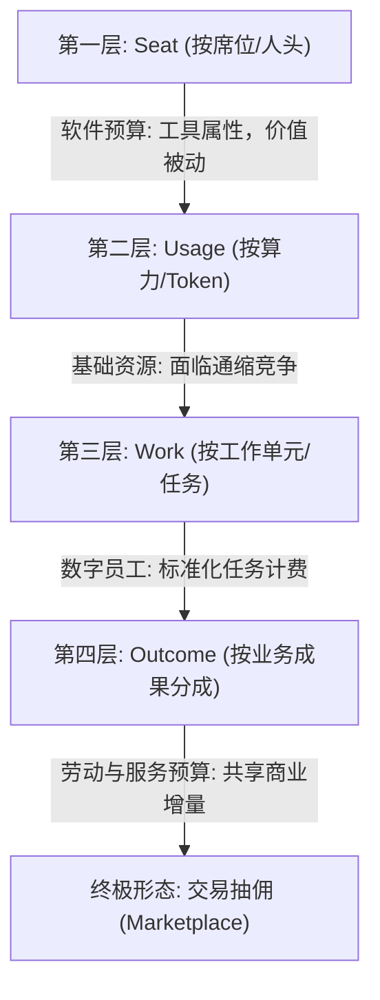
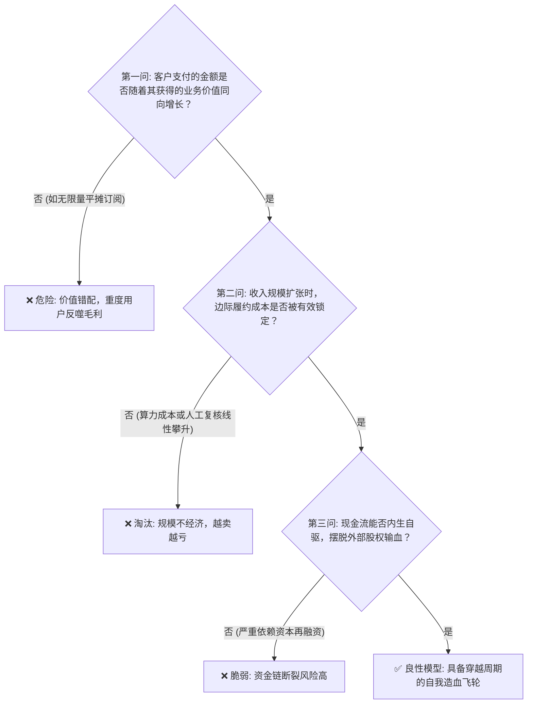

在经历了数年关于大模型参数、多模态能力与通用智能（AGI）的宏大叙事之后，2026 年的科技界正式迎来了残酷的“算账时刻”。

资本市场的态度发生了一百八十度的大转弯：不再询问“你的模型参数有多大”，而是直接摊开财报质问“你的单次交付毛利到底是不是正的”、“自由现金流何时能够自我造血”。

回顾科技史，这与 2000 年互联网泡沫破裂前后的景象何其相似。当年的 Webvan 拥有完全正确的前瞻视野（生鲜电商送货到家），却因为高昂的仓储履约成本与极其脆弱的单位经济模型，最终在烧光数亿美元后迅速崩塌；而 Amazon 依靠对图书单品正向毛利的严格把控、负现金转换周期（CCC）以及严谨的现金流纪律，在废墟中活了下来。

2026 年的 AI 创业者同样站在这个十字路口。如果我们不能厘清单次交互背后的真实经济账本，盲目相信“规模扩大后成本自然会降”，那么 Webvan 式的悲剧将在 AI 领域精准重演。

---

### 一、 传统 SaaS 经济学的破产：推理成本不是零边际

过去二十年，软件行业的估值神话建立在一条铁律之上：**零边际成本（Zero Marginal Cost）**。

在传统 SaaS 模式下，软件开发完毕部署上线后，多服务一个客户所增加的服务器与带宽成本微乎其微。这使得软件公司可以放心地按席位（Per-Seat）收取月费，利用资本杠杆迅速扩大规模。

但在 2026 年的 AI Agent 时代，这个假设彻底失效了。

```text
+-------------------------------------------------------------------------+
|                  传统 SaaS vs AI Agent 成本结构对比                      |
+-------------------+-----------------------------------------------------+
| 传统 SaaS 模型    | 边际成本 ≈ 0 -> 多一个用户 ≈ 纯毛利 -> 席位制成立   |
+-------------------+-----------------------------------------------------+
| AI Agent 模型     | 边际成本 > 0 -> 每次推理消耗真实 GPU/Token -> 席位制破产 |
+-------------------+-----------------------------------------------------+
```

每一次 Agent 的思考、调用工具、检索向量库、多步骤反思，都会产生实打实的 Token 消耗与算力支出。这意味着：

1. **“20 美元无限量 AI”是自杀式毒药**：重度用户会疯狂调用模型，导致底层推理成本（Inference Cost）飙升，而订阅收入固定，最终导致毛利倒挂、越卖越亏；
2. **融资补贴真实成本无以为继**：在当下常态化的高利率与流动性收紧周期中，靠一级市场输血掩盖亏损的模式已经丧失退出通道；
3. **薄套壳 UI 价值归零**：如果产品仅是在开源模型或闭源 API 之上套一层精美的界面，那么随着底层模型能力的直接覆盖与基础设施价格的断崖式下跌，中间商利润空间将被瞬间挤压殆尽。

良性商业模型的底线极其朴素：**收入增长必须与价值创造、交付成本同步，单次交付在扣除真实履约成本后必须维持健康的正向毛利。**

---

### 二、 商业模式的四层梯队：从 Seat 到 Outcome

要摆脱算力倒挂的困境，必须重新理解 AI 产品在企业预算体系中的位置。2026 年的 AI 变现逻辑正在经历从“卖软件工具”到“卖劳动力成果”的结构性跃迁：



#### 1. Seat（席位制）：软件预算
- **逻辑**：人类在使用软件，企业为软件许可证买单。
- **局限**：Agent 的目标是减少人工干预甚至替代人工，如果按人类员工人头收费，Agent 越高效，客户需要采购的席位反而越少，形成商业悖论。

#### 2. Usage（用量制）：算力预算
- **逻辑**：按消耗的 Token 数、API 调用次数或计算时长收费。
- **局限**：Token 正在快速商品化与通缩化。企业越来越倾向于使用小参数模型、端侧量化与开源路由，单纯做 Token 倒买倒卖没有壁垒。

#### 3. Work（工作量制）：任务预算
- **逻辑**：Agent 作为数字员工，按完成的标准化工作单元收费。
- **形式**：每核查一份合同、每匹配一张发票、每清洗 1000 条线索收取固定费用。客户购买的是确定的劳动输出，而非软件使用时长。

#### 4. Outcome（结果制）：业务与服务预算
- **逻辑**：直接进入企业的业务与外包服务预算。客户不再关心你调用了多少次模型，只关心最终创造了多少商业增量或规避了多少损失。
- **形式**：按成功入职的人才收取佣金、按成功追回的欠款抽成、按节省的能耗或云成本比例分成。这是利润空间最丰厚、黏性最高的商业形态。

---

### 三、 垂类解构：寻找每个节点“可计量的经济事件”

不要抽象地讨论“AI 颠覆了哪个行业”，而要在具体的业务链条中定位**高频、标准化、可验证、原本由人工完成且客户已经习惯为此买单的经济事件**。

```text
+-------------------+-----------------------------------+---------------------------+
| 垂类赛道          | 传统模式缺陷                      | 2026 良性计价节点         |
+-------------------+-----------------------------------+---------------------------+
| 智能客服          | 按坐席 50 美元/月 (缺乏激励)      | 0.5 美元 / 成功闭环工单   |
+-------------------+-----------------------------------+---------------------------+
| B2B 销售与 GTM    | 营销自动化平台订阅 (难以归因)     | 2 美元/有效 SQL, 转化抽佣 |
+-------------------+-----------------------------------+---------------------------+
| 猎头与招聘        | 简历库搜寻席位年费 (信息冗余)     | 500-1000 美元 / 成功入职  |
+-------------------+-----------------------------------+---------------------------+
| 财税与对账        | 会计软件 License (依然靠人工录入) | 0.05 美元/发票匹配, 月结费|
+-------------------+-----------------------------------+---------------------------+
| 法务合规          | 昂贵律所工时或静态模板库          | 单合同深度风险审计/项目制 |
+-------------------+-----------------------------------+---------------------------+
| 边缘硬件与 IoT    | 单次硬件买断 (无后续造血)         | 硬件微利 + 边缘云调度 ARR |
+-------------------+-----------------------------------+---------------------------+
```

#### 1. 客服与工单：从坐席费转向解决率（Resolved Ticket）
Sierra、Decagon 以及 Zendesk AI 的演进证明了客服赛道的必然路径：不再按 Seat 收费，而是按“自主解决的工单数量（Resolved Conversation）”结算。
- **关键约束**：必须具备严密的审计归因机制。若用户中途转接人工或对解答不满，该次交互不计入计费事件；
- **毛利红线**：单次模型推理与知识检索成本必须压制在计费单价的 15%–25% 以内，确保综合毛利维持在 75% 以上。

#### 2. B2B 销售与 GTM：从工具软件走向 Lead Gen as a Service
传统的销售工具只卖自动化邮件发送能力，导致垃圾邮件泛滥、转化率趋零。良性的 GTM Agent 应当是一套外包销售代表（SDR）管线：
- **计价单位**：不按发送邮件数量计费，而是按“经过深度清洗合格的销售线索（SQL）”或“促成合格决策人会议（Booked Meeting）”计费；
- **终极闭环**：结合多产品矩阵与交易撮合，直接从最终成单额中提取佣金。

#### 3. 猎头与招聘：切入存量佣金市场
招聘软件过去按账号向 HR 收取年费，但企业每年向外部猎头支付的佣金动辄数万。招聘 Agent 的最佳定位是“AI 猎头助理”：
- **计价节点**：候选人搜寻与简历初筛免费或低费，核心收费节点锚定在“安排有效面试”与“成功发放并签署 Offer”；
- **商业优势**：不需要改变客户的付费心智，直接替代高成本的中介中介费。

#### 4. 边缘计算与工业硬件：硬件微利 + 调度订阅
在网关盒子、车载采集终端或工业质检设备上，纯卖硬件面临激烈的红海价格战。
- **良性模型**：硬件本身按 BOM 成本加价 15%–20% 快速铺设，构筑物理设备壁垒；
- **利润重心**：绑定固件安全更新、端云协同调度与私有模型热更新服务，依靠年化订阅服务费（ARR）贡献全生命周期 80% 以上的利润。

---

### 四、 检验模型健康的“三问铁律”

在评估任何一个 AI 项目或内部孵化业务时，我们可以摒弃一切复杂的估值模型，直接用以下三个问题进行穿透性验证：



1. **价值对齐度**：客户付的钱，是基于他付出的沉没成本，还是基于他获得的明确产出？
2. **边际解耦度**：当客户订单量增长 10 倍时，你的模型推理成本、向量检索成本与人工介入成本是否呈现显著的边际递减？
3. **现金流周期**：业务是否具备预付费或负现金转换周期的特质？能否用经营产生的现金流支持下一阶段的基础设施扩容？

---

### 五、 结语：周期终将出清幻觉

技术的发展从来不是平滑上升的直线，而是伴随着剧烈的狂热、泡沫、出清与重构。

2026 年的市场不再相信“只要占领心智，未来总能盈利”的借口。能够在这场大潮退去后依然屹立的，绝不是那些调用量最大却每天亏损数万美元的明星玩具，而是那些深入具体行业毛细血管、将算力成本精确控制到每一分钱、切实为客户交出可验证成果的数字工匠。

方向正确无法拯救错误的账本，穿越周期的永远是健康的自我造血能力。
